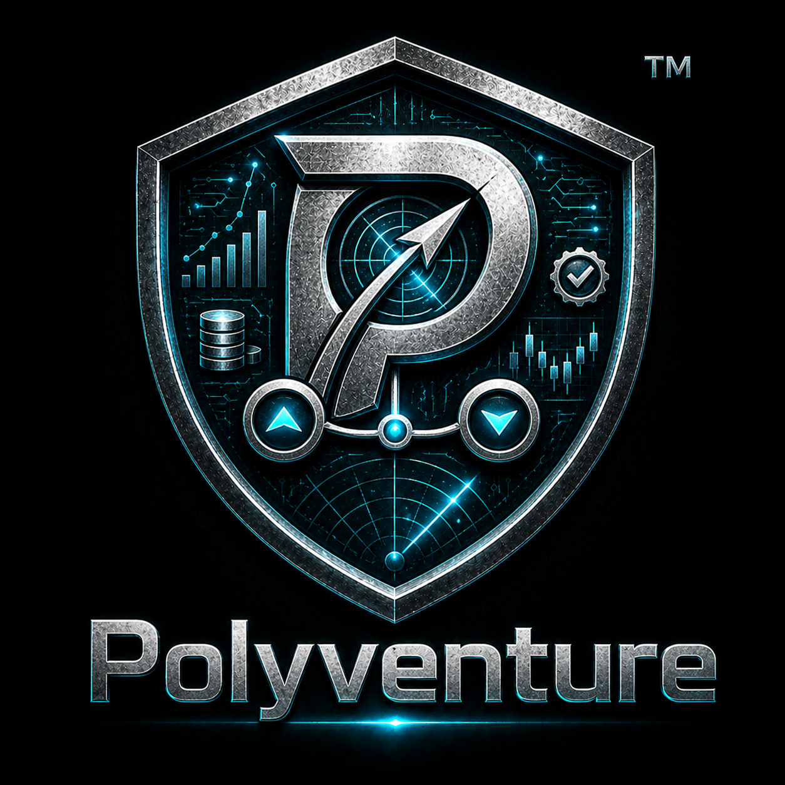

# Support

**Document ID**: `POLYVENTURE_SUPPORT`  
**Status**: Public support guidance  
**Maintainer**: Joe Waller  
**Project**: Polyventure / Polymath  
**Last updated**: 2026-07-09

---

  

## Questions or requests

Use GitHub Issues for:

- bug reports and reproduction questions
- documentation gaps or clarifications
- feature or enhancement suggestions

Please include your host OS, Python version, and concise reproduction steps where relevant. Reproduce
dry-run / offline unless you are deliberately exercising a sandbox or live lane with your own account.

## Private contact

If a report is sensitive, do not include exploit details or secrets in a public issue. If GitHub Security
Advisories are enabled for this repository, open a private advisory; otherwise contact the maintainer via
their GitHub profile. See [`SECURITY.md`](SECURITY.md) for the vulnerability-reporting policy.

## Not supported

This is research and educational software provided as-is. It is not a financial product, and no trading
outcome, uptime, or individualized support is guaranteed.

---

  

