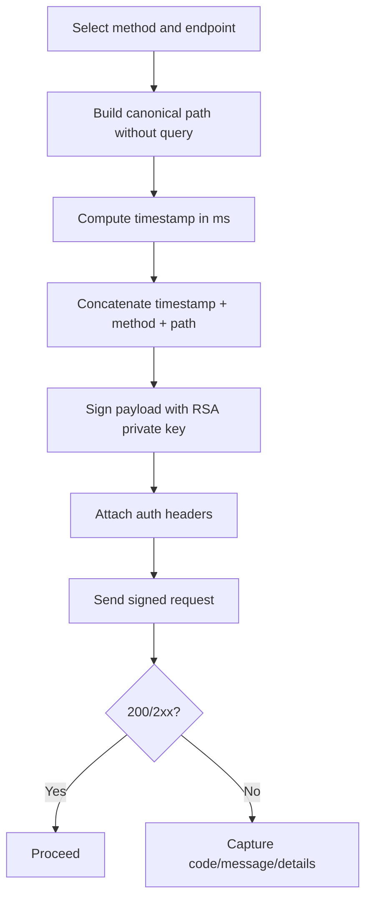

# 01 — Auth & Signing

Back to [Guide Home](./README.md) · Next: [Environments & Lane Routing](./02-environments-and-lane-routing.md)

## Canonical auth headers

Authenticated requests use:

- `KALSHI-ACCESS-KEY`
- `KALSHI-ACCESS-SIGNATURE`
- `KALSHI-ACCESS-TIMESTAMP`

References:

- https://docs.kalshi.com/getting_started/quick_start_authenticated_requests
- https://docs.kalshi.com/getting_started/quick_start_websockets
- https://docs.kalshi.com/openapi.yaml

These same headers are used for both signed REST requests and the authenticated WebSocket handshake. For lane-safe key pairing, see [API Key Lifecycle & Controls](./05-api-key-lifecycle-and-controls.md).

## Signature contract

Kalshi signing input is:

`<timestamp_ms><HTTP_METHOD><path_without_query>`

Where `path_without_query` is the route portion only (for example, `/trade-api/v2/portfolio/balance`).

### Non-negotiables

- Method must be uppercased in the exact bytes used for signing.
- Path must exclude scheme, host, and query string.
- Timestamp must be milliseconds and current enough for server validation.
- Signature uses RSA-PSS with SHA-256.

## REST path construction

For REST requests, sign the full route from the API root:

- sign `/trade-api/v2/portfolio/balance`
- do not sign `https://external-api.kalshi.com/trade-api/v2/portfolio/balance`
- do not include query parameters in the signed payload

Example:

- request URL: `https://external-api.demo.kalshi.co/trade-api/v2/markets?limit=5`
- signed path: `/trade-api/v2/markets`

The hostname can change by lane or compatibility host, but the signed route does not. See [Environments & Lane Routing](./02-environments-and-lane-routing.md).

## WebSocket handshake signing

The authenticated WebSocket upgrade follows the same signing pattern as REST, but the signed path is fixed:

- method: `GET`
- signed path: `/trade-api/ws/v2`
- payload: `timestamp + GET + /trade-api/ws/v2`

If WebSocket auth fails after local signature generation succeeds, treat the incident as a canonical-path check before assuming transport failure. See [WebSocket Lifecycle](./03-websocket-lifecycle-and-channels.md) and [Runbook B](./07-troubleshooting-runbooks.md#runbook-b-auth-fails-after-successful-signature-generation).

## Query stripping and base-URL trap

Two operator mistakes cause avoidable auth failures:

1. signing a path that still contains query parameters;
2. double-prefixing the route when a helper already includes `/trade-api/v2` in the configured base URL.

Operational rule:

- if the helper base URL already ends in `/trade-api/v2`, pass only the endpoint suffix such as `/portfolio/balance`;
- construct the final request URL once;
- sign the resulting root-relative path without the query string.

This is one of the fastest ways to separate local request construction bugs from genuine remote auth rejection.

## Request-signing flow

## Structured REST error envelope

When Kalshi returns a documented structured error body, the reviewed public schema exposes:

- `code`
- `message`
- `details`
- `service`

Operators should retain these fields before summarizing the failure. Human shorthand is useful, but it should not replace the structured truth. For recovery flows, see [Troubleshooting Runbooks](./07-troubleshooting-runbooks.md).

## Parse failure vs auth failure

Use this split during triage:

- **Parse/format failure**: private key file unreadable, malformed PEM, unsupported encoding, or signature generation failure before network call.
- **Auth failure**: key-signature-timestamp triplet sent successfully but server rejects (`401`, auth-related error payload).

See [Runbook A](./07-troubleshooting-runbooks.md#runbook-a-key-validation-fails-before-auth-check).

## Evidence boundary

The reviewed public docs do support structured auth and error evidence, but they do not establish a generic REST request-id or correlation-id response-header contract for arbitrary incidents.

Operational rule:

- retain documented structured fields first;
- retain local artifact references where the implementation preserves them;
- do not describe undocumented correlation headers as though Kalshi guarantees them.

## Cross-links

- Lane-specific key pairing: [API Key Lifecycle & Controls](./05-api-key-lifecycle-and-controls.md)
- Demo/live host selection impacts path+host pairing: [Environments & Lane Routing](./02-environments-and-lane-routing.md)
- WS handshake auth uses the same key family with a different signed path: [WebSocket Lifecycle](./03-websocket-lifecycle-and-channels.md)
- Recovery workflows for parse vs auth failures: [Troubleshooting Runbooks](./07-troubleshooting-runbooks.md)
