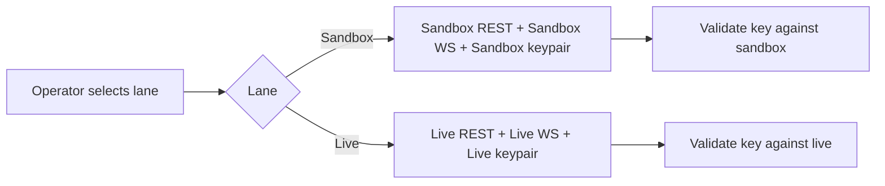

# 02 — Environments & Lane Routing

Back: [Auth & Signing](./01-auth-and-signing.md) · Next: [WebSocket Lifecycle](./03-websocket-lifecycle-and-channels.md)

## Environment model

Kalshi separates environments (demo vs production). Credentials are environment-scoped.

Key references:

- https://docs.kalshi.com/getting_started/api_environments
- https://docs.kalshi.com/getting_started/demo_env

Demo credentials do not work against production endpoints, and production credentials do not work against demo endpoints.

## Environment endpoints

| Lane    | Surface   | Recommended host                                       | Compatibility host                               |
| ------- | --------- | ------------------------------------------------------ | ------------------------------------------------ |
| Live    | REST      | `https://external-api.kalshi.com/trade-api/v2`         | `https://api.elections.kalshi.com/trade-api/v2`  |
| Live    | WebSocket | `wss://external-api-ws.kalshi.com/trade-api/ws/v2`     | `wss://api.elections.kalshi.com/trade-api/ws/v2` |
| Sandbox | REST      | `https://external-api.demo.kalshi.co/trade-api/v2`     | `https://demo-api.kalshi.co/trade-api/v2`        |
| Sandbox | WebSocket | `wss://external-api-ws.demo.kalshi.co/trade-api/ws/v2` | `wss://demo-api.kalshi.co/trade-api/ws/v2`       |

Operator notes:

- the `external-api*` hosts are the recommended endpoints for API traders;
- the shared hosts remain supported for compatibility;
- despite the `api.elections` name, the production compatibility host is not limited to election markets.

## Operator lane policy (recommended)

Treat lane as a first-class runtime variable:

- **Sandbox lane** → demo hosts + demo credentials
- **Live lane** → production hosts + production credentials

Do not mix key material across lanes.

Do not mix REST and WebSocket hosts across lanes either; treat the tuple `(lane, REST host, WS host, API key ID, private key material)` as one operator-owned unit.

## Routing diagram

## Signing invariants across hosts

Host choice changes the destination, not the signed payload.

Examples:

- `https://external-api.kalshi.com/trade-api/v2/portfolio/balance`
- `https://api.elections.kalshi.com/trade-api/v2/portfolio/balance`

Both use the same signed path:

- `/trade-api/v2/portfolio/balance`

The same principle applies to the WebSocket handshake path `/trade-api/ws/v2`.

See [Auth & Signing](./01-auth-and-signing.md) for the signature contract and [WebSocket Lifecycle](./03-websocket-lifecycle-and-channels.md) for the handshake flow.

## Runtime-source doctrine

The endpoint tables above anchor intended lane routing, but endpoint correctness alone is not a complete proof of active runtime truth in any client or operator shell.

Host-family correctness is a **baseline**, not a complete proof of active runtime truth.

When lane classification is under dispute, reconcile these surfaces together:

1. resolved settings / dotenv posture,
2. active runtime DB path,
3. websocket URL tail observed in runtime evidence,
4. detached shell bootstrap/report posture.

Operational rule:

1. use the documented endpoint table to validate intended lane routing,
2. then reconcile that intent against the active runtime source-of-truth surfaces:
    - resolved settings / dotenv posture,
    - active runtime DB path,
    - websocket URL tail observed in runtime evidence,
    - detached shell bootstrap/report posture,
3. preserve websocket-connect truth separately from the first authenticated account-scoped HTTP scan step,
4. do not treat one stale or non-authoritative surface as though it overrides the others.

## Validation checklist

1. Confirm selected lane.
2. Confirm REST base URL for lane.
3. Confirm WS host/path for lane.
4. Confirm API key ID and private key file pair for same lane.
5. Confirm signed path is lane-invariant and excludes query parameters.
6. Run authenticated probe endpoint.

If step 6 fails, use [Runbook B](./07-troubleshooting-runbooks.md#runbook-b-auth-fails-after-successful-signature-generation). If the tuple itself looks mismatched, start with [Runbook C](./07-troubleshooting-runbooks.md#runbook-c-demo-key-applied-to-live-or-reverse).

## Cross-links

- Signing invariants and canonical paths: [Auth & Signing](./01-auth-and-signing.md)
- Key pairing policy: [API Key Lifecycle & Controls](./05-api-key-lifecycle-and-controls.md)
- WS host/path and channel behavior: [WebSocket Lifecycle](./03-websocket-lifecycle-and-channels.md)
- Recovery workflows for lane mismatch and auth rejection: [Troubleshooting Runbooks](./07-troubleshooting-runbooks.md)
