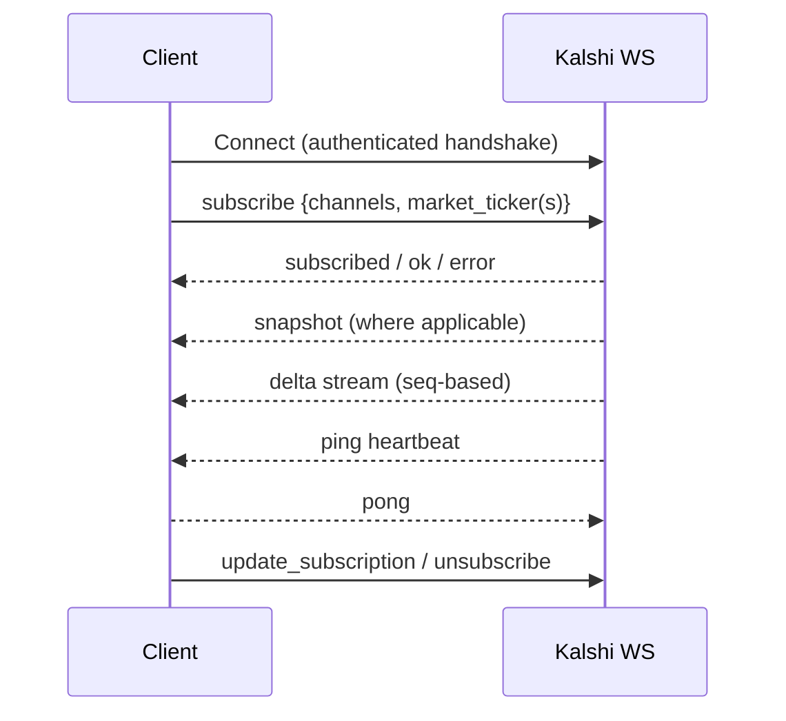
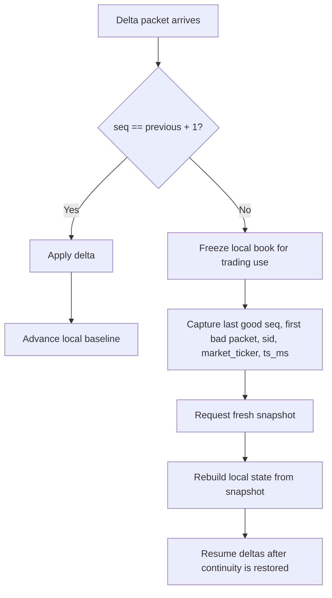
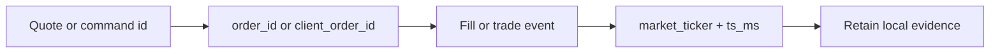

# 03 — WebSocket Lifecycle & Channels

Back: [Environments & Lane Routing](./02-environments-and-lane-routing.md) · Next: [Rate Limits & Throughput](./04-rate-limits-and-throughput.md)

## WebSocket session model

Reference docs:

- https://docs.kalshi.com/websockets
- https://docs.kalshi.com/getting_started/quick_start_websockets
- https://docs.kalshi.com/websockets/websocket-connection
- https://docs.kalshi.com/websockets/connection-keep-alive
- https://docs.kalshi.com/websockets/orderbook-updates
- https://docs.kalshi.com/websockets/market-and-event-lifecycle.md (lifecycle/close/settle — verified 2026-06-19)
- https://docs.kalshi.com/websockets/public-trades.md (trade prints — verified 2026-06-19)
- https://docs.kalshi.com/websockets/cfbenchmarks-value.md (benchmark feed — verified 2026-06-19)
- https://docs.kalshi.com/websockets/communications
- https://docs.kalshi.com/getting_started/order_direction
- https://docs.kalshi.com/asyncapi.yaml
- Channel index (verified 2026-06-19): https://docs.kalshi.com/llms.txt

Kalshi uses authenticated WebSocket sessions for market and private channels.

The authenticated handshake uses the same key family as signed REST requests:

- `KALSHI-ACCESS-KEY`
- `KALSHI-ACCESS-SIGNATURE`
- `KALSHI-ACCESS-TIMESTAMP`

For the WebSocket upgrade, the signature payload is:

- `timestamp + GET + /trade-api/ws/v2`

Lane selection changes the host, not the signed path. See [Environments & Lane Routing](./02-environments-and-lane-routing.md) and [Auth & Signing](./01-auth-and-signing.md).

## Keep-alive contract

- Kalshi emits ping control frames approximately every 10 seconds.
- Client should reply with pong to maintain healthy connection.
- Keepalive success proves transport health, not market-state freshness; retain channel-level evidence when diagnosing stale reads or delayed updates.

## Subscription lifecycle



## Command-plane contract

The authenticated WebSocket session is one connection with a command plane layered on top.

Primary commands documented in the connection reference:

| Command               | Purpose                                 | Notes                                                                                                      |
| --------------------- | --------------------------------------- | ---------------------------------------------------------------------------------------------------------- |
| `subscribe`           | Start one or more channel subscriptions | Requires `params.channels`; many channels also require `market_ticker` or `market_tickers`                 |
| `unsubscribe`         | Cancel one or more active subscriptions | Uses active subscription ids (`sid` / `sids`)                                                              |
| `list_subscriptions`  | Return all active subscriptions         | Useful during reconnect or drift diagnosis                                                                 |
| `update_subscription` | Modify an existing subscription         | Used for actions such as `add_markets`, `delete_markets`, and channel-specific actions like `get_snapshot` |

Primary response families:

| Response type  | Meaning                                  | Retain when troubleshooting                              |
| -------------- | ---------------------------------------- | -------------------------------------------------------- |
| `subscribed`   | New subscription accepted                | command `id`, returned `sid`, requested channels/markets |
| `ok`           | Valid update/list operation completed    | command `id`, target `sid`, action                       |
| `unsubscribed` | Subscription removal accepted            | command `id`, removed `sid`                              |
| `error`        | Command rejected or channel start failed | command `id`, error `code`, error `msg`                  |

Operational rule: when command-plane behavior is part of the incident, retain the outgoing command family and the corresponding response family before summarizing the result. This shortens recovery time dramatically for subscription drift, reconnect ambiguity, and channel-specific misuse.

## Command error families worth retaining

The reviewed WebSocket docs expose a stable error envelope:

```json
{
    "id": 123,
    "type": "error",
    "msg": {
        "code": 2,
        "msg": "Params required"
    }
}
```

High-value error families for operator retention include:

- malformed or incompatible message payloads,
- missing params / channels / subscription ids,
- unknown command or unknown channel,
- authentication required,
- invalid parameter or market not found,
- unsupported action on `update_subscription`,
- command timeout or internal channel error,
- subscription buffer overflow during bursts.

If a command fails, capture:

- command `id`,
- target `sid` when applicable,
- requested channel(s),
- requested market filter(s),
- error `code`,
- error `msg`.

This is often enough to separate local command misuse from real transport or exchange-side instability.

Primary command families documented in the AsyncAPI and WebSocket guides:

- `subscribe`
- `unsubscribe`
- `update_subscription`
- `list_subscriptions`

Primary response families operators should expect to retain:

- `subscribed`
- `ok`
- `unsubscribed`
- `error`

When diagnosing command-plane failures, capture the command `id`, the returned status family, and any error code/message pair. Fast triage expectations live in [Operator Quick Reference](./OPERATOR_QUICK_REFERENCE.md).

## High-value channels

- Public market data: `orderbook_delta`, `ticker`, `trade`, `cfbenchmarks_value`
- Private user data: `fill`, `user_orders`, `market_positions`
- Lifecycle: `market_lifecycle_v2`, multivariate lifecycle channels
- Communications: RFQ/quote channels (authenticated)

Error codes and command semantics are documented in AsyncAPI; see [Index](./INDEX.md#websocket-commands-and-errors).

Operator notes:

- `orderbook_delta` is the primary gap-sensitive stream; it is the first place to enforce strict sequence checks.
- Communications channels are high-value evidence surfaces because quote and fill activity can share identifiers needed for local reconciliation.
- Pricing interpretation must remain consistent with the subscription mode; see `use_yes_price` below before reconciling book-side or outcome-side values.

## Market & event lifecycle channel (`market_lifecycle_v2`)

Primary source: https://docs.kalshi.com/websockets/market-and-event-lifecycle.md (verified 2026-06-19) · AsyncAPI: https://docs.kalshi.com/asyncapi.yaml

This is the authoritative exchange-side feed for when markets open, change close date, are determined, and settle. It answers a question operators repeatedly get wrong by assumption.

**Subscription scope — all markets, no filtering.** The channel "Receives all market and event lifecycle notifications (`market_ticker` filters are not supported)." You subscribe to the channel, not to a ticker set; you then receive lifecycle events for **every** market.

**Delivery is NOT conditioned on position or order.** The documentation states no position/order condition. Lifecycle events (including close and settlement) are delivered for markets where you hold no position and placed no order. Therefore: an application that is **not subscribed** to this channel receives **no** close/settlement signal at all — market closes are silent on the orderbook/ticker channels. Do not infer that "a market closing pushes events to our connection" unless this channel is subscribed. (Polyventure integration status: not currently subscribed — see [Polyventure Integration Map](./06-polyventure-integration-map.md).)

**Messages:** `marketLifecycleV2`, `eventLifecycle`, `eventFeeUpdate`.

**`marketLifecycleV2.event_type` enum (8 values):**

| `event_type` | Meaning |
| --- | --- |
| `created` | Market created (carries `open_ts`) |
| `activated` | Market activated (tradeable) |
| `deactivated` | Market deactivated (`is_deactivated`) |
| `close_date_updated` | Close date changed (carries updated `close_ts`) |
| `determined` | Outcome determined (carries `determination_ts`, `result`) |
| `settled` | Market settled (carries `settled_ts`, `settlement_value`) |
| `price_level_structure_updated` | Price-level structure changed |
| `metadata_updated` | Metadata changed (e.g. `floor_strike`, `yes_sub_title`) |

**Key fields:** `market_ticker`, `result`, `settlement_value`, `is_deactivated`, `price_level_structure`; strike metadata `strike_type`, `floor_strike`, `cap_strike`, `custom_strike`, `yes_sub_title`.

**Timestamp fields (all Unix seconds):** `open_ts` (on creation), `close_ts` (on creation or `close_date_updated`), `determination_ts` (on `determined`), `settled_ts` (on `settled`), plus `expected_expiration_ts` in `additional_metadata`.

**Subscription limits:** none documented for this channel.

**Operational reading for candidate lifecycle:** `close_ts` here is the authoritative close clock and supersedes a REST-fetched `close_time` when they disagree (markets can close early — note `can_close_early` in metadata — or have their close date updated). `determined` / `settled` are the ground truth for reconciliation, distinct from a computed close. A candidate-expiry mechanism that wants exchange truth (rather than a computed deadline) must subscribe to this channel.

## Public trades channel (`trade`)

Primary source: https://docs.kalshi.com/websockets/public-trades.md · AsyncAPI verified 2026-06-19.

Public print flow per market. Fields: `trade_id`, `market_ticker`, `yes_price_dollars`, `no_price_dollars`, `count_fp` (fixed-point size), `taker_outcome_side` (`yes`/`no`), `taker_book_side` (`bid`/`ask`), `ts_ms` (Unix ms). Legacy `taker_side` and `ts` are deprecated — use the canonical direction fields and `ts_ms`. Operational value: realized liquidity/print flow for edge and depth enrichment.

## CF Benchmarks value channel (`cfbenchmarks_value`)

Primary source: https://docs.kalshi.com/websockets/cfbenchmarks-value.md · AsyncAPI verified 2026-06-19.

Benchmark/index value feed for index- and crypto-settled markets. Fields: `index_id`, `received_at` (Unix ms), `data` (raw JSON), `avg_60s_data` (object: `value`, `window_size`, `window_start_ts_ms`, `window_end_ts_exclusive`), and `last_60s_windowed_average_15min` (present only in the final minute before a quarter-hour close). Operational value: independent pricing reference for benchmark-settled candidates.

## Private execution channels and what they mean operationally

For authenticated trading clients, the most important private execution channels are:

| Channel               | Purpose                                         | Filtering rules                                                                | Operational use                                                                        |
| --------------------- | ----------------------------------------------- | ------------------------------------------------------------------------------ | -------------------------------------------------------------------------------------- |
| `user_orders`         | Real-time order created / updated notifications | `market_tickers` optional; omit for all orders                                 | Track resting, canceled, executed, and otherwise updated orders in real time           |
| `fill`                | Real-time fill notifications                    | `market_ticker` / `market_tickers` optional; omit for all fills                | Track matched trading activity and execution timing                                    |
| `market_positions`    | Real-time position updates                      | `market_ticker` / `market_tickers` only; `market_id` filters are not supported | Track position, portfolio drift, and position-side changes after fills and settlements |
| `order_group_updates` | Order-group lifecycle and limit updates         | market specification ignored                                                   | Track group creation, trigger/reset/delete activity, and rolling-limit enforcement     |

Operational reading:

- `user_orders` is the primary order-state stream,
- `fill` is the primary matched-execution stream,
- `market_positions` is the primary position-change stream,
- `order_group_updates` is the primary automatic limit/protection stream when order groups are in use.

These streams are complementary, not interchangeable. During execution incidents, retain enough evidence to reconstruct all three levels when possible:

1. order intent and order-state change,
2. fill occurrence,
3. position consequence.

If order groups are part of the strategy, retain order-group updates alongside the ordinary order/fill streams rather than treating group-trigger behavior as unexplained cancellation noise.

## Orderbook channel constraints and recovery hooks

`orderbook_delta` has several constraints that matter operationally:

1. authentication is still required because the WebSocket session itself is authenticated,
2. market specification is required,
3. this channel supports `market_ticker` or `market_tickers`, but not `market_id` or `market_ids`,
4. the channel sends `orderbook_snapshot` first and then incremental `orderbook_delta` updates,
5. `update_subscription` supports `add_markets`, `delete_markets`, and `get_snapshot`,
6. `get_snapshot` returns a fresh `orderbook_snapshot` for the requested markets without changing the underlying subscription.

That last point is central to recovery: snapshot refresh is a first-class operator tool, not a hack. When sequence continuity breaks, prefer a documented `get_snapshot` re-baseline path before declaring the stream unusable.

## Sequence integrity

For channels with `seq`, enforce monotonic checks and recover with snapshot on detected gaps.

Retain these fields when available:

- command `id`
- subscription `sid`
- sequence number `seq`
- `market_ticker`
- `market_id`
- `ts_ms`

Recommended recovery posture:

1. Stop using the affected stream for trading decisions.
2. Capture the last known good `seq` and the first bad packet.
3. Request a fresh snapshot with `get_snapshot` where the channel supports it.
4. Re-baseline local state from the fresh snapshot.
5. Resume delta application only after continuity is re-established.



See [Runbook D](./07-troubleshooting-runbooks.md#runbook-d-orderbook-delta-desync-or-sequence-gaps).

## Communications correlation

Authenticated communications channels can expose quote and fill-adjacent events that matter during incident reconstruction.

When a quote or downstream execution path matters, retain:

- quote or command `id`
- `market_ticker`
- `order_id`
- `client_order_id`
- `trade_id` when present
- `ts_ms`

Treat these events as evidence breadcrumbs rather than as a substitute for the full local record.



The communications channel also supports optional sharding controls for fanout management:

- `shard_factor` (1-100)
- `shard_key` where `0 <= shard_key < shard_factor`

If communications traffic is part of an incident, capture those values as part of the subscription evidence. They are part of the execution context, not incidental tuning trivia.

## Direction fields and migration posture

Kalshi now expresses direction with two equivalent vocabularies:

- `outcome_side` -> `yes` / `no`
- `book_side` -> `bid` / `ask`

On public trade surfaces, the fields are reported as:

- `taker_outcome_side`
- `taker_book_side`

Operational rules:

1. treat `outcome_side` / `book_side` as the canonical direction fields going forward,
2. treat legacy fields (`action`, `side`, `is_yes`, `purchased_side`, `taker_side`) as migration aids only,
3. do not let local reconstruction mix canonical and legacy direction vocabularies without explicitly naming the translation.

This matters most when reconciling:

- order create/cancel/amend records,
- fill updates,
- public trade evidence,
- and orderbook-side interpretation.

## `use_yes_price` handling

Some orderbook and direction semantics depend on whether pricing is being interpreted in YES-price mode.

Operator rules:

- Retain whether `use_yes_price` was enabled when capturing evidence.
- Do not compare packets captured under different pricing assumptions as though they were directly equivalent.
- If price direction or side interpretation looks inverted, classify the issue as a pricing-mode check before classifying it as data corruption.

See [Runbook F](./07-troubleshooting-runbooks.md#runbook-f-pricing-scale-confusion-or-use_yes_price-mismatch) and [Glossary](./GLOSSARY.md).

## Transport vs application-flow classification

Do **not** classify an incident as a websocket-handshake defect merely because a higher-level workflow stops early.

Operators must preserve these separate truths:

1. a healthy websocket session and heartbeat posture can coexist with an accepted-then-fast-failed scan path,
2. `Find candidates` incidents must not be collapsed into a single story; preserve these two distinct problem families:
    - **auth-gate / early-funnel failure**, and
    - **workload/result-path overrun**,
3. local application-runtime contract failures must be classified separately from exchange transport or exchange auth failures.

Operational reading for this handbook:

1. a healthy websocket session proves transport/session health only,
2. it does **not** by itself prove the first authenticated account-scoped HTTP checks will pass,
3. use application-runtime evidence before recommending websocket or auth-path mutation.

## Cross-links

- Handshake signing rules: [Auth & Signing](./01-auth-and-signing.md)
- Lane host alignment: [Environments & Lane Routing](./02-environments-and-lane-routing.md)
- Operator evidence checklist: [Operator Quick Reference](./OPERATOR_QUICK_REFERENCE.md)
- Throughput budgeting for reconnect storms: [Rate Limits & Throughput](./04-rate-limits-and-throughput.md)
- Recovery workflows: [Troubleshooting Runbooks](./07-troubleshooting-runbooks.md)
