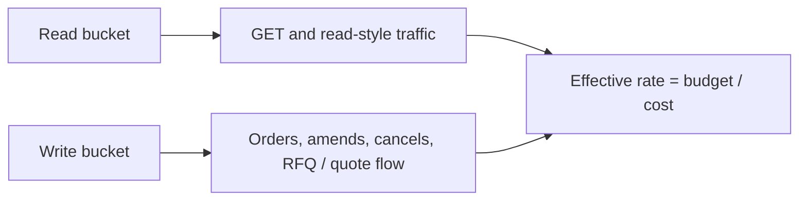
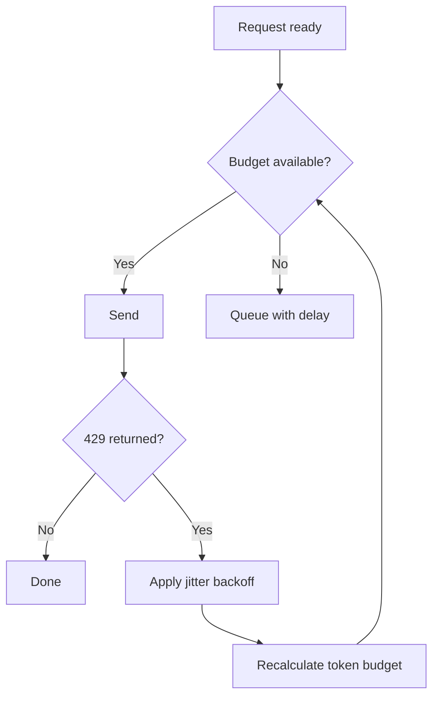
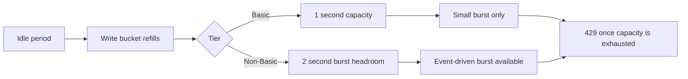

# 04 — Rate Limits & Throughput Design

Back: [WebSocket Lifecycle](./03-websocket-lifecycle-and-channels.md) · Next: [API Key Lifecycle & Controls](./05-api-key-lifecycle-and-controls.md)

## Token-bucket model

Reference: https://docs.kalshi.com/getting_started/rate_limits and `GetAccountApiLimits` in OpenAPI.

Kalshi applies token-bucket budgets. Most endpoints default to cost 10 tokens unless otherwise specified.

Read and write traffic are billed against separate buckets.

| Bucket | Covers                                                                   |
| ------ | ------------------------------------------------------------------------ |
| Read   | GET endpoints and any traffic not explicitly routed elsewhere            |
| Write  | order placement, amends, cancels, order groups, and the RFQ / quote flow |

Your effective rate for an endpoint is `bucket_budget ÷ endpoint_cost`.



## Tier budgets

Per-second token budgets from the reviewed public docs:

| Tier     | Read budget | Write budget |
| -------- | ----------- | ------------ |
| Basic    | 200         | 100          |
| Advanced | 300         | 300          |
| Expert   | 600         | 600          |
| Premier  | 1,000       | 1,000        |
| Paragon  | 2,000       | 2,000        |
| Prime    | 4,000       | 4,000        |
| Prestige | 6,000       | 8,000        |

Query the account limits surface when the live account tier matters operationally.

## Practical design rules

1. Budget by lane and endpoint class (read-heavy vs write-heavy).
2. Batch where endpoint semantics support it.
3. Backoff with jitter on 429.
4. Keep retry policy idempotent for mutation endpoints.
5. Monitor per-endpoint cost overrides (`GetAccountEndpointCosts`).

Important cost notes from the reviewed docs and OpenAPI:

- default endpoint cost is 10 tokens;
- some endpoints are cheaper, such as single-order reads and single-order cancels at 2 tokens;
- batch endpoints do not save tokens per item.

## Throttling flow



## Batch billing and endpoint overrides

Batching changes request shape, not token economics.

- batch create orders: `N × 10` tokens for `N` orders
- batch cancel orders: `N × 2` tokens for `N` cancels

Operators should treat `GetAccountEndpointCosts` as the authoritative source for non-default endpoint costs on the active account.

Operational note:

- maximum batch size also scales with the active tier's write budget,
- so batch design should be constrained by both total token cost and the account's burst headroom.

## 429 evidence and local backoff contract

The reviewed rate-limit docs show the current `429` body as:

```json
{"error": "too many requests"}
```

The same docs also state that `429` responses do not currently include:

- `Retry-After`
- `X-RateLimit-*`

Operational consequence:

1. the client must own retry pacing,
2. backoff should be jittered,
3. reconnect storms and eager write retries should not share one naive retry cadence,
4. retained evidence should capture enough local context to explain whether the pressure was read-bucket, write-bucket, or reconnect-fanout induced.

## Burst headroom

The write bucket can hold more than one second of budget.

- Basic is the exception: its write bucket holds one second of budget only.
- Non-Basic tiers can accumulate two seconds of write-budget headroom.

This is useful for event-driven bursts, but it is not free throughput. Once the bucket is drained, requests return `429` until enough tokens refill.



## Failure-mode notes

- A reconnect storm plus eager resubscribe can cascade into 429s.
- A single global retry policy for all endpoints is usually suboptimal; split by endpoint cost and business criticality.
- `429` responses are documented without `Retry-After` or `X-RateLimit-*` headers, so the client must apply its own jittered exponential backoff.
- WebSocket reconnect logic and REST mutation logic should not blindly share the same retry cadence.

## Cross-links

- Reconnect pressure first appears in the WebSocket layer: [WebSocket Lifecycle](./03-websocket-lifecycle-and-channels.md)
- Key rotation windows and retry safety: [API Key Lifecycle & Controls](./05-api-key-lifecycle-and-controls.md)
- Runbook for 429 storms: [Runbook E](./07-troubleshooting-runbooks.md#runbook-e-rate-limit-thrashing-429-storm)
- Pause-related order behavior and `cancel_order_on_pause` matter during incident review: [Troubleshooting Runbooks](./07-troubleshooting-runbooks.md#runbook-h-maintenance-window-or-exchange-pause-disrupts-expected-behavior)
