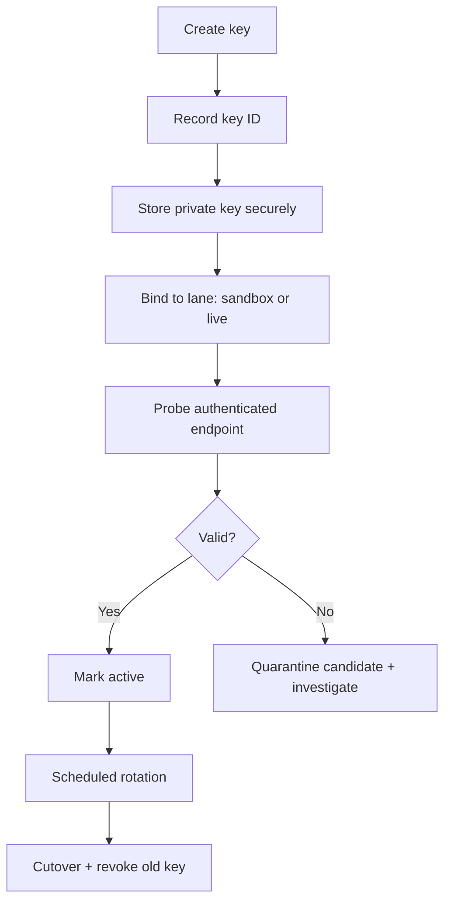

# 05 — API Key Lifecycle & Operational Controls

Back: [Rate Limits & Throughput](./04-rate-limits-and-throughput.md) · Next: [Polyventure Integration Map](./06-polyventure-integration-map.md)

## Lifecycle stages

1. Generate or register keypair
2. Store private key securely
3. Bind key ID + private key path + lane
4. Validate with authenticated probe
5. Promote to active runtime
6. Rotate and retire old key

The reviewed public docs describe the same overall operator process for demo and production, but the resulting credentials remain environment-specific and cannot be reused across lanes.

## Key lifecycle diagram

## Lane-safe pairing contract

Always treat this as an immutable tuple during a session:

`(lane, api_key_id, private_key_path)`

A mismatch in any member should block promotion to active state.

## Generation and registration facts

Two creation paths matter operationally:

- generate a keypair through Kalshi and receive a private key plus key ID;
- register a public key and receive a key ID for the uploaded keypair.

Operational facts from the reviewed docs and OpenAPI:

- the private key returned by the generated-key flow cannot be retrieved later;
- scopes are attached to API keys and should be treated as part of the key inventory record;
- the environment-facing process shape is the same in demo and production, but the resulting credentials remain separate.

## Creation-path handling rules

Treat the two creation paths differently in local operator inventory:

### Generated-key flow

- Kalshi creates the keypair,
- the private key is shown once and downloaded once,
- the operator must move that key into durable secure storage immediately,
- if the key is not captured before the page/session closes, replace it rather than treating it as recoverable.

### Uploaded-public-key flow

- the operator keeps control of the private key material outside Kalshi,
- Kalshi binds the uploaded public key to a returned key ID,
- local inventory must still track lane, key name, key ID, and scope set,
- the private key remains secret-bearing local material and stays out of logs and reports.

The inventory rule is the same either way: operators should reason about key identity and lane binding, not about redisplaying or re-deriving private key contents.

## Storage and reporting rules

- Store private key material securely and outside user-facing logs or reports.
- Record key inventory by name and key ID, not by private key contents.
- Treat downloaded key files as sensitive artifacts that must be moved into durable operator storage before browser/session state is lost.
- If a generated key was not securely stored before the page closed, replace it rather than trying to recover it.

## Operational controls

- Keep separate key inventories for demo and live.
- Log when candidate keys are staged, validated, applied, or rejected.
- Require explicit operator confirmation for live-lane key apply actions.
- Never persist private key content in logs or reports.

For evidence reporting, retain names-only lifecycle facts such as:

- lane
- key name
- key ID
- scope set
- validation result
- promotion / quarantine decision
- local artifact path tail when evidence was retained

## Cross-links

- Auth mechanics: [Auth & Signing](./01-auth-and-signing.md)
- Lane governance: [Environments & Lane Routing](./02-environments-and-lane-routing.md)
- Probe and mismatch recovery: [Troubleshooting Runbooks](./07-troubleshooting-runbooks.md)
- Runbook for key mismatch: [Runbook C](./07-troubleshooting-runbooks.md#runbook-c-demo-key-applied-to-live-or-reverse)
