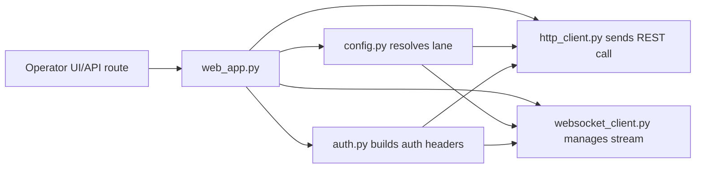
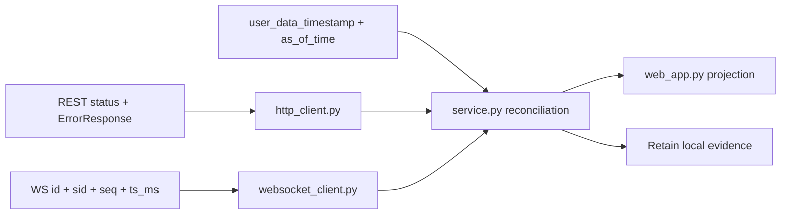

# 06 — Polyventure Integration Map

Back: [API Key Lifecycle & Controls](./05-api-key-lifecycle-and-controls.md) · Next: [Troubleshooting Runbooks](./07-troubleshooting-runbooks.md)

## Local modules of interest

- `src/polyventure/auth.py`
  - private key loading
  - path normalization for signing input
  - signature construction and auth headers
- `src/polyventure/http_client.py`
  - authenticated REST call handling
  - error classification and transport handling
- `src/polyventure/config.py`
  - environment/lane settings resolution
- `src/polyventure/sandbox_preflight.py`
  - lane preflight checks and credential acceptance logic
- `src/polyventure/websocket_client.py`
  - WS handshake auth headers and stream handling
- `src/polyventure/web_app.py`
  - operator routes for stage/validate/apply/load key workflow

These modules should stay aligned with the handbook chapters they operationalize:

- `auth.py` -> [Auth & Signing](./01-auth-and-signing.md)
- `config.py` and preflight logic -> [Environments & Lane Routing](./02-environments-and-lane-routing.md)
- `websocket_client.py` -> [WebSocket Lifecycle](./03-websocket-lifecycle-and-channels.md)
- `http_client.py` -> [Auth & Signing](./01-auth-and-signing.md) and [Rate Limits & Throughput](./04-rate-limits-and-throughput.md)

## Runtime responsibility map

## Observed integration focus areas

1. Keep lane and key pairing explicit through stage → validate → apply.
2. Distinguish local key parse failures from remote auth rejections.
3. Preserve stable error reason codes for operator triage.
4. Keep WS control-plane behavior deterministic under reconnect.

## Market-data foundation mapping

Kalshi's public market-data surfaces are part of the local integration contract even when they do not require authentication.

Important operator-facing facts to preserve locally:

1. `GET /markets` and related public market endpoints can be used without auth for market discovery,
2. `GET /markets/{ticker}/orderbook` returns bids only, not asks,
3. implied asks are reconstructed from the reciprocal YES/NO relationship,
4. the highest bid is the last element in the returned price array,
5. orderbook values are fixed-point dollar strings and fixed-point contract counts.

This matters locally because scan/ranking/report surfaces must not describe implied asks, best prices, or orderbook depth as though those were independent raw exchange fields. They are derived interpretations of the returned bid arrays.

## Forensic evidence mapping

The local integration layer should preserve the exchange-documented fields that matter most during incident review.

### REST evidence to retain

- HTTP status code
- structured error fields: `code`, `message`, `details`, `service`
- request path actually signed
- lane and host family used

### WebSocket evidence to retain

- error code / message pairs
- command `id`
- subscription `sid`
- sequence number `seq`
- `market_ticker`
- `market_id`
- `order_id`
- `client_order_id`
- `trade_id`
- `ts_ms`

### Freshness reconciliation evidence

When a write succeeds but REST follow-up reads look stale, preserve:

- mutation response payload
- relevant WebSocket truth stream events
- `/exchange/user_data_timestamp` result, especially `as_of_time`
- local artifact path tail for retained evidence

The user-data timestamp endpoint is a freshness cross-check, not a substitute for the underlying mutation response or WebSocket stream.

  ## Execution and private-channel evidence mapping

  When local execution or execution simulation is being reasoned about, the integration map should preserve the exchange-side evidence chain in this order:

  1. REST write or local submit intent,
  2. `user_orders` update,
  3. `fill` update when a match occurs,
  4. `market_positions` update when position changes,
  5. `order_group_updates` when group limits or triggers affect the result,
  6. optional freshness reconciliation through `/exchange/user_data_timestamp` if REST follow-up reads appear behind the stream.

  Local operational rule:

  - do not treat one of these surfaces as a total substitute for the others,
  - and do not let a human summary collapse order-state, fill-state, and position-state into one ambiguous event.

  For `polyventure`, the minimum local propagation targets for execution incidents should therefore include:

  - `http_client.py` for REST status/result and structured errors,
  - `websocket_client.py` for `user_orders`, `fill`, `market_positions`, and `order_group_updates` capture,
  - `service.py` for reconciliation and runtime-event emission,
  - `web_app.py` for operator projection,
  - retained local evidence for chronology reconstruction.

  ## Direction and pricing interpretation mapping

  Local integration should now prefer the canonical Kalshi direction fields:

  - `outcome_side`
  - `book_side`
  - `taker_outcome_side`
  - `taker_book_side`

  Operational rule:

  1. new local code and new retained evidence summaries should prefer the canonical fields,
  2. legacy fields should be translated deliberately when encountered,
  3. orderbook interpretation must remain aware of `use_yes_price` because the orderbook channels are the main exception surface where side changes can also flip price scale when the legacy mode is still in effect.

## Projection targets inside `polyventure`

At minimum, the reviewed field set should be able to flow through:

- `http_client.py` transport/error classification
- `websocket_client.py` event handling and gap detection
- `service.py` reconciliation and runtime-event emission
- `web_app.py` operator-facing projection surfaces

Operational rule: separate exchange-documented evidence from local retained evidence so UI or report summaries do not blur the source of truth.

## Polyventure owner-proof stack

When lane ownership or active runtime truth is under dispute, preserve and reconcile this Polyventure-specific evidence stack in addition to the generic exchange documentation.

Preserve and reconcile these surfaces in order:

1. **launch and shell identity**
  - detached host launch through `.venv-core`,
  - attached shell identity,
  - signed shell routes carrying both `session` and `launch`,
2. **names-only owner matrix**
  - operation lane,
  - environment,
  - REST base-url tail,
  - websocket URL tail,
  - API-key source class,
  - API-key id tail/class,
  - private-key path tail,
  - owner-path comparison between websocket activation and REST/account-check logic,
3. **runtime DB truth**
  - active state DB path,
  - websocket session rows,
  - scan request / progress / terminal rows,
4. **monitor and shell projection evidence**
  - passive monitor packet,
  - bootstrap/report/system-log payloads,
  - observed operator-shell result.

Operational doctrine:

1. do not let a stale `.env` snapshot or an old DB read substitute for the active runtime DB,
2. do not let a `session_identity_mismatch` probe result stand in for exchange auth failure unless the probe was already launch-aware,
3. if websocket connect succeeds while account-scoped REST checks fail, preserve those as separate truths,
4. if the launch-aware replay completes normally, fail closed back to planning instead of inventing an auth mutation story.

## Cross-links

- Signature specifics: [Auth & Signing](./01-auth-and-signing.md)
- Lane model: [Environments & Lane Routing](./02-environments-and-lane-routing.md)
- Channel behavior and keepalive: [WebSocket Lifecycle](./03-websocket-lifecycle-and-channels.md)
- First-response evidence capture: [Operator Quick Reference](./OPERATOR_QUICK_REFERENCE.md)
- Issue-driven guidance: [Troubleshooting Runbooks](./07-troubleshooting-runbooks.md)
- Term definitions: [Glossary](./GLOSSARY.md)
