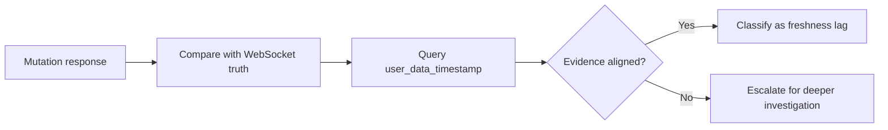
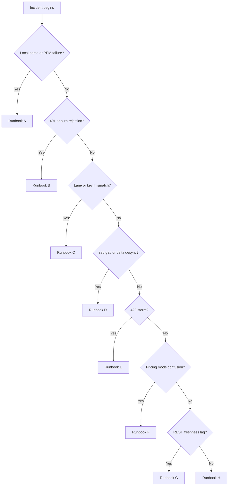

# 07 — Troubleshooting Runbooks

Back: [Polyventure Integration Map](./06-polyventure-integration-map.md) · See also: [Index](./INDEX.md)

## Runbook A: Key validation fails before auth check

**Symptoms**
- Validation call reports formatting or parse-level failure.
- No reliable indication request reached authenticated endpoint validation.

**Actions**
1. Verify key file path exists and permissions are correct.
2. Verify PEM format is valid and complete.
3. Re-run local signing function with controlled payload.
4. Confirm the selected `(lane, api_key_id, private_key_path)` tuple.

**Likely root causes**
- Corrupt key material
- Wrong key file selected
- Unsupported/private key format issue

References: [Auth & Signing](./01-auth-and-signing.md), [API Key Lifecycle](./05-api-key-lifecycle-and-controls.md)

## Runbook B: Auth fails after successful signature generation

**Symptoms**
- Signature generated locally.
- API returns auth rejection (`401` or auth-related payload).

**Actions**
1. Confirm timestamp freshness (ms precision).
2. Confirm exact canonical path used in signing input.
3. Confirm method casing and exact request method.
4. Confirm key ID belongs to selected lane environment.
5. For WebSocket failures, confirm the signed handshake path was `/trade-api/ws/v2`.

References: [Auth & Signing](./01-auth-and-signing.md), [Environments & Lane Routing](./02-environments-and-lane-routing.md)

## Runbook C: Demo key applied to live (or reverse)

**Symptoms**
- Key appears syntactically valid but consistently fails in one lane.

**Actions**
1. Compare lane selection to key inventory metadata.
2. Probe both environments intentionally and capture per-environment results.
3. Re-bind tuple and re-apply only after explicit confirmation.

Reference: [API Key Lifecycle & Controls](./05-api-key-lifecycle-and-controls.md)

## Runbook D: Orderbook delta desync or sequence gaps

**Symptoms**
- Non-monotonic `seq` values.
- Local orderbook drift from exchange state.
- Snapshot/delta replay no longer produces a coherent local book.

**Actions**
1. Freeze trading decisions that rely on stale book.
2. Capture the last good `seq`, the first bad `seq`, `sid`, `market_ticker`, and `ts_ms`.
3. Request/obtain fresh snapshot with `get_snapshot` where supported.
4. Resume delta application only from validated sequence baseline.
5. Add gap metrics and alerting.

Reference: [WebSocket Lifecycle](./03-websocket-lifecycle-and-channels.md)

## Runbook E: Rate-limit thrashing (429 storm)

**Symptoms**
- Bursts of `429` across retries and parallel workers.

**Actions**
1. Classify endpoints by token cost.
2. Apply jittered exponential backoff.
3. Introduce queueing and concurrency caps per endpoint class.
4. Reassess reconnect/resubscribe storm patterns.

Reference: [Rate Limits & Throughput](./04-rate-limits-and-throughput.md)

## Runbook F: Pricing scale confusion or `use_yes_price` mismatch

**Symptoms**
- Price interpretation appears inverted across packets or tools.
- Book-side or outcome-side reasoning changes between capture points.
- Operators disagree on whether a quoted value is in YES-price terms.

**Actions**
1. Confirm whether `use_yes_price` was enabled for the affected subscription or request path.
2. Capture the exact packet fields being compared, including `market_ticker`, side fields, and timestamps.
3. Re-run the interpretation using one pricing mode only; do not mix YES-price and non-YES-price reasoning in the same reconstruction.
4. Only escalate to corruption or desync after pricing-mode mismatch is ruled out.

References: [WebSocket Lifecycle](./03-websocket-lifecycle-and-channels.md), [Glossary](./GLOSSARY.md)

## Runbook G: REST write succeeded but follow-up read looks stale

**Symptoms**
- A write or mutation returned success, but the next REST read does not reflect the expected state.
- WebSocket updates and REST reads disagree briefly.
- Operators cannot tell whether the issue is latency, stale polling, or failed propagation.

**Actions**
1. Capture the mutation result, including status code and any structured error or success fields.
2. Compare against the relevant WebSocket truth stream before concluding the write failed.
3. Query `/exchange/user_data_timestamp` to determine the freshness watermark exposed by Kalshi.
4. Classify the incident as freshness lag unless the write, WebSocket, and timestamp evidence all disagree.
5. Retain artifact references for the local evidence record.

References: [Operator Quick Reference](./OPERATOR_QUICK_REFERENCE.md)

## Runbook H: Maintenance window or exchange pause disrupts expected behavior

**Symptoms**
- Orders stop behaving normally around a known maintenance or pause window.
- Channels remain reachable but trading actions are blocked, delayed, or cancelled.
- Operators observe pause-related behavior without a local code change.

**Kalshi market availability**
Kalshi is not a traditional trading market. It operates 24 hours a day, 7 days a week. The only scheduled maintenance window is **Thursday 3:00–5:00 AM local time** (operator's configured timezone). Outside this window, the exchange is expected to be available and accepting orders. Zero candidates returned by an active scan at any other hour is not a market-availability issue — investigate entry window filter settings, edge/profit thresholds, and current market conditions instead.

**Actions**
1. Confirm the incident timestamp falls within the Thursday 3:00–5:00 AM local maintenance window before classifying as a maintenance-related disruption.
2. If outside the maintenance window, do not classify as market closure — rule out entry window filter, threshold configuration, and market conditions first.
3. Determine whether `cancel_order_on_pause` or related exchange behavior is relevant to the incident class.
4. Capture lane, host, market identifiers, and timestamps before retrying actions.
5. Resume normal classification only after maintenance/pause state is ruled out.

References: [Rate Limits & Throughput](./04-rate-limits-and-throughput.md), [Operator Quick Reference](./OPERATOR_QUICK_REFERENCE.md)

## Runbook I: REST write acknowledged, but private execution streams disagree or lag

**Symptoms**
- Create/cancel/amend path returns success, but `user_orders` does not yet show the expected update.
- `fill` or `market_positions` arrives later than expected relative to the write response.
- Local execution chronology becomes ambiguous even though no outright auth failure occurred.

**Actions**
1. Capture the write response first, including HTTP status and any structured payload.
2. Capture the corresponding `user_orders` evidence for the same order identity (`order_id`, `client_order_id`).
3. If a match occurred, capture the `fill` update and its timestamps/ids.
4. If position changed, capture the corresponding `market_positions` update.
5. If follow-up REST reads appear stale, query `/exchange/user_data_timestamp` and classify the incident as freshness lag unless the stream evidence contradicts it.
6. Keep order-state, fill-state, and position-state evidence separate in the retained summary.

References: [WebSocket Lifecycle](./03-websocket-lifecycle-and-channels.md), [Operator Quick Reference](./OPERATOR_QUICK_REFERENCE.md)

## Runbook J: Order group limit or trigger behavior causes unexpected cancels or blocking

**Symptoms**
- Orders are cancelled or blocked without a simple single-order explanation.
- Grouped execution appears to stop after a rolling-limit hit.
- Local chronology shows order changes but the real trigger appears to be group state.

**Actions**
1. Determine whether the affected orders were associated with an order group.
2. Capture any `order_group_updates` events around the incident window.
3. Classify whether the group was created, triggered, reset, deleted, or had its limit updated.
4. Retain the related `user_orders` and `fill` evidence so the group-side trigger is not misread as isolated order failure.
5. If order flow resumes only after reset, classify the event as a group-limit lifecycle incident rather than generic exchange instability.

References: [WebSocket Lifecycle](./03-websocket-lifecycle-and-channels.md)

## Polyventure-specific local-runtime runbooks

The runbooks below depend on Polyventure-local runtime evidence, shell contracts, and implementation-specific owner surfaces. Keep them separate from the general Kalshi API recovery paths above.

## Runbook K: Live WebSocket healthy but `Find candidates` fast-fails before first progress

**Symptoms**
- Live websocket session connects and heartbeats normally.
- `Find candidates` is accepted, then fails almost immediately.
- Runtime evidence shows `scan_request_accepted` followed by `scan_background_failed`.
- Failure family reads `credential_acceptance_failed`.
- No `scan_progress` stage appears before the terminal failure.

**Actions**
1. Capture the runtime DB rows for websocket connect/heartbeat plus the scan request/terminal failure window.
2. Do **not** classify the incident as a websocket-handshake failure if websocket connect and heartbeat truth are present.
3. Freeze a names-only owner matrix for the active lane covering websocket activation and REST/account-check owner paths.
4. Re-run the observed shell proof with a launch-aware, session-aligned packet.
5. If the launch-aware run no longer reproduces the fast-fail, fail closed back to planning/evidence reconciliation rather than jumping directly to auth-path mutation.

**Why this matters**
- This pattern sits on a transport/auth classification boundary: websocket success and early authenticated HTTP failure can coexist.
- If a launch-aware replay does not reproduce the fast-fail, reconcile owner surfaces and fail closed to evidence review before mutating auth-path behavior.

References: [WebSocket Lifecycle](./03-websocket-lifecycle-and-channels.md), [Polyventure Integration Map](./06-polyventure-integration-map.md), `../TRANCHE_F_SCHEDULED_CHANGE_VALIDATION_REGISTER_2026-05-25.md`

## Runbook L: Local shell signed probe returns `session_identity_mismatch`

**Symptoms**
- Signed `/api/report`, `/api/scan`, or similar local shell route returns `403`.
- Reason family is `session_identity_mismatch`.
- The shell itself may still be visible and otherwise appear healthy.

**Actions**
1. Confirm the probe carries both `session` and `launch` identity values.
2. Confirm the probe is hitting the currently attached shell host inside its live attach/session window.
3. Treat the mismatch as a local shell-contract issue until a launch-aware replay disproves that reading.
4. Only after shell/session alignment is corrected should any remaining HTTP or credential failure be classified as product auth behavior.

**Why this matters**
- Signed local shell probes are authoritative only when they carry both `session` and `launch` identity.
- An under-specified probe can create a local mismatch family that is not the same thing as exchange auth rejection.

References: [WebSocket Lifecycle](./03-websocket-lifecycle-and-channels.md), [Polyventure Integration Map](./06-polyventure-integration-map.md), `../TRANCHE_F_SCHEDULED_CHANGE_VALIDATION_REGISTER_2026-05-25.md`

## Runbook M: Sandbox WS connect probe fails with HTTP 503; live lane healthy

**Symptoms**
- Sandbox mode change preflight reaches `websocket_connect_probe` then fails with `websocket_service_unavailable`.
- Credential acceptance and endpoint validation both pass.
- Live lane connects normally.
- TCP/TLS reachability to sandbox WS host resolves fine; the 503 is returned at the HTTP upgrade layer by `awselb/2.0`.
- Both recommended (`external-api-ws.demo.kalshi.co`) and compatibility (`demo-api.kalshi.co`) sandbox WS hosts return 503.
- Kalshi status page may report the platform as healthy — this is not a contradiction (see below).

**Diagnostic steps**

1. Confirm with a raw WS handshake probe (not just TCP connect) that the 503 is at the HTTP upgrade layer.
2. Probe variant paths on the same WS host (`/ws`, `/`, `/v1`, `/v2/ws`). If those return `404` but `/trade-api/ws/v2` returns `503`, the ALB routing rule for the correct path exists and the URL is right — the backend target group behind that path is unhealthy. A `404` on all paths indicates a wrong host or path.
3. Confirm credential acceptance still passes — it will, because REST and WS demo endpoints share the same ALB IPs but route to separate backend pools. REST pool healthy + WS pool unhealthy = 503 on WS, pass on REST.
4. Do a DNS lookup: `external-api-ws.demo.kalshi.co` and `external-api.demo.kalshi.co` resolve to the same IPs. This confirms a single ALB with multiple target groups — not a network-level split.
5. If live WS returns `401 Unauthorized` (JSON body from the Kalshi application), that proves the live ALB routes through to the app. If sandbox WS returns bare HTML `503` from the ELB, that proves the request never reaches the Kalshi app.

**Why Kalshi status page may show green**

Kalshi's demo platform health check likely probes the REST API, not the WS backend pool. REST and WS demo endpoints share the same ALB but route to different backend target groups. If only the WS target group is unhealthy, REST stays green, and a REST-only health check reports the platform as up.

**Actions**
1. Confirm the WS host returns 503 on `/trade-api/ws/v2` and 404 on other paths (proves URL is correct, backend is the issue).
2. Contact Kalshi specifically about the **demo WebSocket backend** being unhealthy — phrase it as a WS-specific issue, not a general platform issue, since REST is healthy.
3. No client config change will resolve this — both sandbox WS hosts share the same failing backend pool.
4. Retry sandbox mode change after Kalshi confirms the demo WS backend is restored.

**What NOT to do**
- Do not switch sandbox WS URL hoping to work around the 503 — both sandbox hosts share the same failing backend.
- Do not modify credentials — REST acceptance passes, so credentials are valid.
- Do not treat a green Kalshi status page as proof that the WS backend is healthy.
- Do not add fallback routing logic.

**Root cause**
Kalshi demo WS backend target group unhealthy on the shared ALB. REST demo is unaffected. No client-side fix available until Kalshi restores the WS backend pool.

**Confirmed by Kalshi support (2026-06-12)**
Kalshi support confirmed: "That 503 is consistent with the WebSocket host being temporarily unavailable... Since the 503 comes back from awselb/2.0 before auth is evaluated, there isn't anything in the auth headers you can change to make it succeed right now. The practical next step is to retry the WebSocket connection after a short delay and monitor for recovery."
URL `wss://external-api-ws.demo.kalshi.co/trade-api/ws/v2` and signed message format `{timestamp_ms}GET/trade-api/ws/v2` confirmed correct.

References: [Environments & Lane Routing](./02-environments-and-lane-routing.md), [WebSocket Lifecycle](./03-websocket-lifecycle-and-channels.md)

## Evidence boundaries

Kalshi's reviewed public docs do document useful incident evidence, including:

- structured REST error payload fields,
- WebSocket error code/message pairs,
- `id`, `sid`, `seq`,
- market, order, and trade identifiers,
- timestamp fields such as `ts_ms` and `as_of_time`.

The same reviewed public docs do not establish a general-purpose REST correlation-id response-header contract or server-internal traces for arbitrary incidents.

Operational rule: classify local evidence and exchange-documented evidence separately so incident summaries stay truthful.

## Fast triage matrix

| Symptom                                         | First check                                                  | Primary chapter                                                      |
| ----------------------------------------------- | ------------------------------------------------------------ | -------------------------------------------------------------------- |
| `format_error`/parse failure                    | key file integrity and PEM validity                          | [Auth & Signing](./01-auth-and-signing.md)                           |
| 401 after signing                               | canonical path/method/timestamp                              | [Auth & Signing](./01-auth-and-signing.md)                           |
| Works in demo, fails in live                    | lane/key mismatch                                            | [Environments & Lane Routing](./02-environments-and-lane-routing.md) |
| WS disconnect churn                             | heartbeat and reconnect policy                               | [WebSocket Lifecycle](./03-websocket-lifecycle-and-channels.md)      |
| 429 spikes                                      | token budget and retry fanout                                | [Rate Limits & Throughput](./04-rate-limits-and-throughput.md)       |
| Price fields look inverted                      | `use_yes_price` interpretation                               | [WebSocket Lifecycle](./03-websocket-lifecycle-and-channels.md)      |
| REST read looks stale                           | websocket truth + freshness check                            | [Runbook G](./07-troubleshooting-runbooks.md#runbook-g-rest-write-succeeded-but-follow-up-read-looks-stale)            |
| Trading actions pause                           | maintenance / exchange pause state                           | [Rate Limits & Throughput](./04-rate-limits-and-throughput.md)       |
| Write succeeded but stream chronology disagrees | `user_orders` -> `fill` -> `market_positions` evidence chain | [Runbook I](./07-troubleshooting-runbooks.md#runbook-i-rest-write-acknowledged-but-private-execution-streams-disagree-or-lag) |
| Unexpected grouped cancel/block behavior        | `order_group_updates` evidence                               | [WebSocket Lifecycle](./03-websocket-lifecycle-and-channels.md)      |
| Live scan fast-fails before first progress      | separate healthy WS posture from first authenticated HTTP failure | [Runbook K](./07-troubleshooting-runbooks.md#runbook-k-live-websocket-healthy-but-find-candidates-fast-fails-before-first-progress) |
| Local signed shell probe returns `session_identity_mismatch` | confirm `session` + `launch` identity pairing                | [Runbook L](./07-troubleshooting-runbooks.md#runbook-l-local-shell-signed-probe-returns-session_identity_mismatch) |
| `websocket_service_unavailable` on sandbox; live healthy      | WS handshake probe both sandbox hosts; confirm HTTP 503 from ELB | [Runbook M](./07-troubleshooting-runbooks.md#runbook-m-sandbox-ws-connect-probe-fails-with-http-503-live-lane-healthy) |
